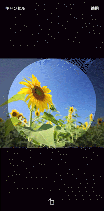

# ImageCliperView

[![Swift Version][swift-image]][swift-url]
[![Build Status][travis-image]][travis-url]
[![License][license-image]][license-url]

Image clipping view for SwiftUI.
Although it is a circle on the screen, cut it into a square.



## Table of Contents

- [Installation](#installation)
- [Usage example](#usage-example)
- [Release History](#release-history)
- [Meta](#meta)

## Installation

### Swift Package Manager (Recommended)

#### Package

You can add this package to `Package.swift`, include it in your target dependencies.

```swift
let package = Package(
    dependencies: [
        .package(url: "https://github.com/issetwo/image-cliper-view"),
    ],
    targets: [
        .target(
            name: "ImageCliperView",
            dependencies: []),
    ]
)
```

#### Xcode

You can add this package on Xcode.
See [documentation](https://developer.apple.com/documentation/swift_packages/adding_package_dependencies_to_your_app).

## Usage example

```swift
import SwiftUI
import ImageCliperView

struct ProfileEditImage: View {
    @Binding var image: UIImage
    @State var size: CGFloat = 80
    @State private var showingImagePicker = false
    @State private var showingImageCliper = false
    @State private var editingImage: UIImage? = nil

    var body: some View {
        ProfileImage(image: $image, size: size)
            .onTapGesture {
                self.showingImagePicker.toggle()
            }
            .fullScreenCover(isPresented: $showingImagePicker, onDismiss: {
                if editingImage != nil {
                    DispatchQueue.main.asyncAfter(deadline: .now() + 0.01) {
                        self.showingImageCliper.toggle()
                    }
                }
            }) {
                PhotoLibraryImagePickerView(image: $editingImage)
            }
            .fullScreenCover(isPresented: $showingImageCliper, onDismiss: {
                if editingImage != nil {
                    self.image = editingImage!
                }
            }) {
                ImageCliperView(image: $editingImage,
                                cancelString: "Cancel",
                                applyString: "Apply",
                                maxScale: 5.0)
            }
    }
}
```

## Release History

* 0.1.0
    * Work in progress

## Meta

Kazuto Yamada – [@issetwo](https://twitter.com/issetwo)

Distributed under the MIT license. See ``LICENSE`` for more information.

[https://github.com/issetwo/image-cliper-view](https://github.com/issetwo)

[swift-image]:https://img.shields.io/badge/swift-5.0-orange.svg
[swift-url]: https://swift.org/
[license-image]: https://img.shields.io/badge/License-MIT-blue.svg
[license-url]: LICENSE
[travis-image]: https://img.shields.io/travis/dbader/node-datadog-metrics/master.svg
[travis-url]: https://travis-ci.org/dbader/node-datadog-metrics
